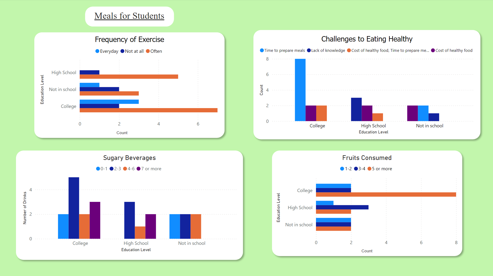
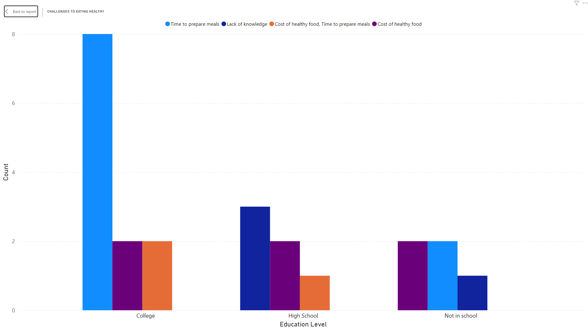
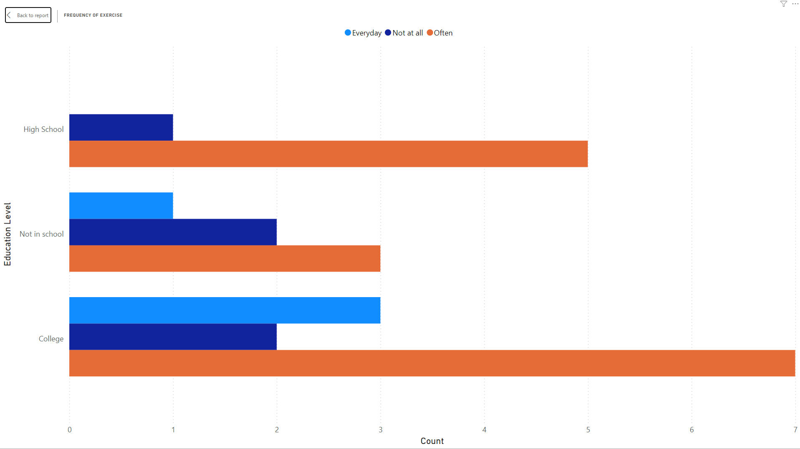

# A-happier-healthier-me

##Overview
- Find the information about people who attend A Happier Healthier Me events and target specific grants.

## What is the reason for the project?
- Find the ages, education levels, and difficulties people face to eat healthier
- Eating habits people have that attend the events
- Frequency in which they exercise

## Images

# Conclusion
- Majority of people that attend are in college
- Most people exercise often followed by everyday
- Most of the time people eat 5 or more fruits a week

# Technologies
- This project was written mainly with Jupyter Notebook, Pandas, Matplotlib, Python, and Power Bi.
